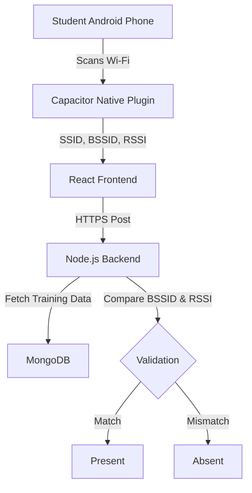

# Android Wi-Fi Fingerprinting System Implementation

## 1. System Architecture



## 2. Android Native Implementation (Capacitor)

Since browsers strictly block access to BSSID and RSSI for privacy, you MUST use a Native Capacitor Plugin.

### A. AndroidManifest.xml
Add these permissions to `android/app/src/main/AndroidManifest.xml`:

```xml
<!-- Location is required to read Wi-Fi BSSID/RSSI on Android 8+ -->
<uses-permission android:name="android.permission.ACCESS_FINE_LOCATION" />
<uses-permission android:name="android.permission.ACCESS_COARSE_LOCATION" />
<uses-permission android:name="android.permission.ACCESS_WIFI_STATE" />
<uses-permission android:name="android.permission.CHANGE_WIFI_STATE" />
<uses-permission android:name="android.permission.INTERNET" />

<!-- For Android 13+ (API 33+) -->
<uses-permission android:name="android.permission.NEARBY_WIFI_DEVICES" />
```

### B. WifiScannerPlugin.java
Create this file in `android/app/src/main/java/com/eduport/app/WifiScannerPlugin.java`:

```java
package com.eduport.app;

import android.Manifest;
import android.content.Context;
import android.content.pm.PackageManager;
import android.net.wifi.ScanResult;
import android.net.wifi.WifiInfo;
import android.net.wifi.WifiManager;
import android.os.Build;
import androidx.core.app.ActivityCompat;

import com.getcapacitor.JSObject;
import com.getcapacitor.Plugin;
import com.getcapacitor.PluginCall;
import com.getcapacitor.PluginMethod;
import com.getcapacitor.annotation.CapacitorPlugin;
import com.getcapacitor.annotation.Permission;

import java.util.List;
import org.json.JSONArray;

@CapacitorPlugin(
    name = "WifiScanner",
    permissions = {
        @Permission(strings = {Manifest.permission.ACCESS_FINE_LOCATION}, alias = "location"),
        @Permission(strings = {Manifest.permission.NEARBY_WIFI_DEVICES}, alias = "nearby")
    }
)
public class WifiScannerPlugin extends Plugin {

    @PluginMethod
    public void scan(PluginCall call) {
        if (getPermissionState("location") != PermissionState.GRANTED) {
            requestPermissionForAlias("location", call, "permissionCallback");
            return;
        }

        Context context = getContext();
        WifiManager wifiManager = (WifiManager) context.getApplicationContext().getSystemService(Context.WIFI_SERVICE);

        if (!wifiManager.isWifiEnabled()) {
            call.reject("Wi-Fi is disabled");
            return;
        }

        // Get Current Connection Info
        WifiInfo connectionInfo = wifiManager.getConnectionInfo();
        String currentSSID = connectionInfo.getSSID().replace("\"", "");
        String currentBSSID = connectionInfo.getBSSID();
        int currentRSSI = connectionInfo.getRssi();
        
        // Get Gateway IP
        int ipAddress = wifiManager.getDhcpInfo().gateway;
        String gatewayIp = String.format("%d.%d.%d.%d",
                (ipAddress & 0xff),
                (ipAddress >> 8 & 0xff),
                (ipAddress >> 16 & 0xff),
                (ipAddress >> 24 & 0xff));

        JSObject result = new JSObject();
        result.put("SSID", currentSSID);
        result.put("BSSID", currentBSSID);
        result.put("RSSI", currentRSSI);
        result.put("Gateway", gatewayIp);

        // Security Check: Detect if it's a mobile hotspot (Best Effort)
        // Android doesn't expose "isHotspot" directly, but often hotspots have specific OUI ranges
        // or we rely on the strictly trained BSSID matching backend-side.
        
        call.resolve(result);
    }
}
```

### C. MainActivity.java
Register the plugin in `MainActivity.java`:

```java
public class MainActivity extends BridgeActivity {
    @Override
    public void onCreate(Bundle savedInstanceState) {
        registerPlugin(WifiScannerPlugin.class);
        super.onCreate(savedInstanceState);
    }
}
```

## 3. Frontend Integration (Attendance.jsx)

```javascript
import { registerPlugin } from '@capacitor/core';
const WifiScanner = registerPlugin('WifiScanner');

const scanWifi = async () => {
    try {
        const result = await WifiScanner.scan();
        console.log('Scan:', result);
        return result; 
        // Returns { SSID: "HITECHCMD-21", BSSID: "xx:xx...", RSSI: -60, Gateway: "172.16.0.1" }
    } catch (e) {
        console.error("Scan failed", e);
        // Fallback for Web/Testing
        return { 
            SSID: "HITECHCMD-21", 
            BSSID: "00:00:00:00:00:00", 
            RSSI: -50, 
            Gateway: "172.16.0.1" 
        };
    }
};
```

## 4. Backend Validation Logic (Secure)

The backend MUST validate:
1. **SSID Match**: Matches `HITECHCMD-21`.
2. **Gateway Match**: Matches `172.16.0.1`.
3. **BSSID Match**: The user's BSSID must be in the `trained_bssids` list for that room.
4. **RSSI Threshold**: The user's RSSI must be > (trained_avg_rssi - variance).

This prevents:
- **VPN Spoofing**: VPN changes IP but not BSSID/SSID as read by OS.
- **Hotspot Spoofing**: Attacker can name hotspot "HITECHCMD-21" but their BSSID (MAC) will be random/different. The system only accepts BSSIDs recorded during Faculty Training.
